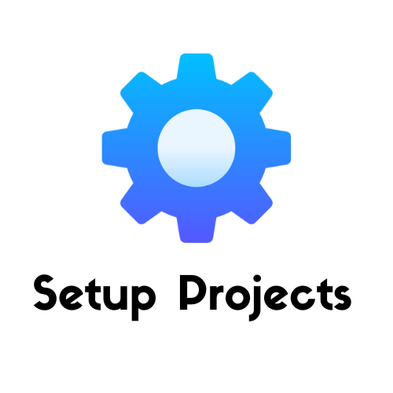

<p align="center">
  
</p>

<p align="center">
  


</p>

<h1 align="center">
    Setup Project
</h1>
<p align="center">
    This repository contains scripts to configure standard code styles and commit messages for projects using Node and Typescript
</p>

<br>

## 🧪 Technologies

This project was developed using the following technologies:

- [Eslint](https://eslint.org/)
- [CommitLint](https://commitlint.js.org/#/)
- [Commitizen](https://commitizen-tools.github.io/commitizen/)
- [Husky](https://typicode.github.io/husky/#/)

## 🚀 Getting started

Clone the project and access the folder.

```bash
git clone https://github.com/NitoBa/setup-projects.git

cd setup-projects
```

Run this command to install the dependencies.

```bash
npm install
```

## Installing in your project

```bash
curl -o- https://raw.githubusercontent.com/NitoBa/setup-projects/main/setup.sh | bash
```

```bash
wget -q0- https://raw.githubusercontent.com/NitoBa/setup-projects/main/setup.sh | bash
```

### Recommended for Windows

This script use [jq](https://stedolan.github.io/jq/) as dependecie, then

> First things first, is important that you have installed chocolatey package manager.
> After that, execute this command: `choco install jq`


```bash
curl -o- https://raw.githubusercontent.com/NitoBa/setup-projects/main/setup.sh | sh
```

## 📝 License

This project is licensed under the MIT License. See the [LICENSE](LICENSE) file for details.

---

Made with 💜 by [Bruno Alves](https://nito-dev.vercel.app/) 👋

